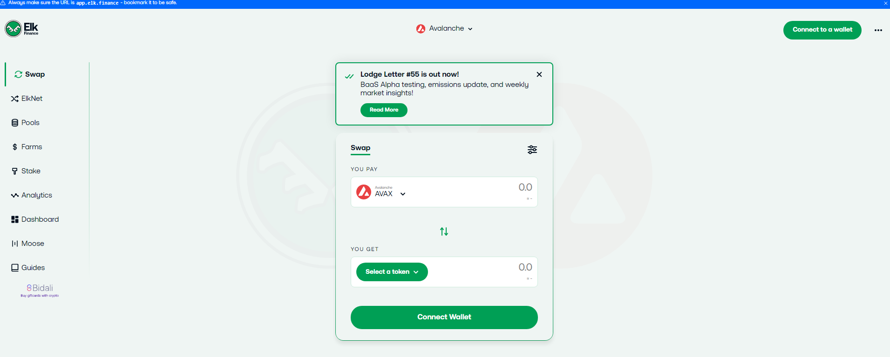
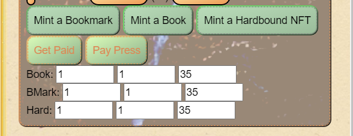
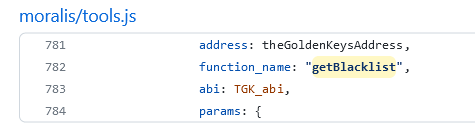
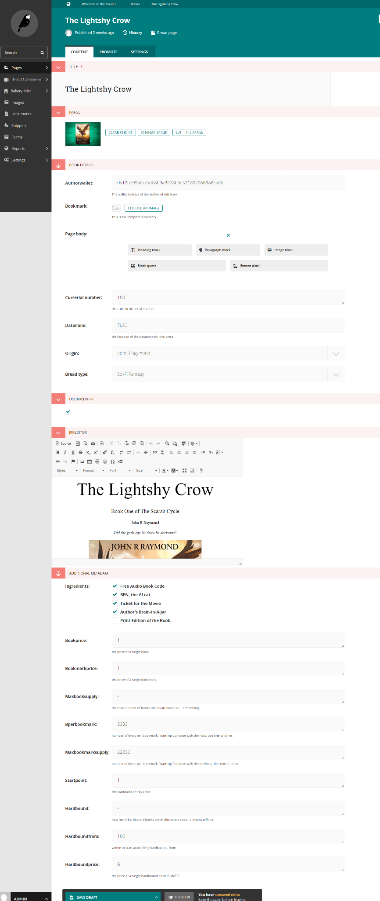
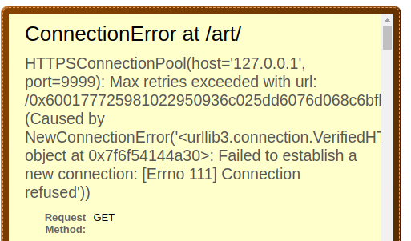

# Specifications for The Great Library

Specifications for The Great Library::

Part A::Primary Manifests::

1. **Code Review**
   1. >)
      1. This code sets up all the addon contracts for each BT, BM, or HB contract.
         1. It makes sure that the printing press contract address appears in the isAddons\[] mapping for each “BookTradable.”
         2.

             <figure><figcaption></figcaption></figure>
      2. This subroutine **setupAddonPrintingPress** also makes sure that the marketplace contract address is also an addon to culture coin.
         1. (Probably shouldn’t need to do this more than once per marketplace deployment.)
      3. For example: require(addons\[msg.sender], "You can't use this function yet.");
         1. This works inside of culture coin. (Yes. The semantics should be unified between the contracts.)
   2. See **addonMintTo**() below.
2. **Website Flow-Control and Design**

Culture Coin’s ICO should be the first thing the site brings up to a new wallet address logging in to the site. The users can then click on 1 of three boxes. One for 10 CC, another for 1CC and the third for 0.1 CC

Under the three boxes are a fourth and a fifth option available to the user. The fourth is a selector. The fifth is a later link.

This is sort of how the bottom part should look. elk.finance

Once the user has experienced the ICO process from the ICO page they will be presented three buttons as options:

>)

Read takes the readers to the great library main site. Play lets them mint a hero and enter the game loop. Trade brings the buyers to the NFT Marketplace(s) hosted by the site.

Main pages should have the standard welcoming message and ability to see promoted books and other site materials. **Important note: no author may be unduly preferenced by the site!**

>)

Example 1: Mockup of the front page of the site.

Clicking on a book should show the book and any relevant stats about the book: price, percentage of the bookmarks sold, top earning bookmarks, author wallet address, other relevant information like a link to the game, etc.

What the book page should look like

Clicking on the text of the book should also bring up the bookmark in a modal dialog box:

The modal dialog box for when a user clicks on text in the book

Clicking on the “Owner Controls” from the main book page should bring up a dialog allowing the contract owner for the book to edit the default values, mint books, and bookmarks, etc.

Example 2: This is how authors currently control their contracts.

(Defaut Price Default Start Default End)

**This section should also have a link to info about the author.-jrr**

On the page there is a place to buy, sell, stake, and unstake Culture Coin.

>)

Example from current site.

**This area should have a button here as well to enter the NFT Marketplace directly. -jrr**

**Minting heroes is as simple as choosing 1 out of 150 different hero classes/types after clicking “Mint Hero” from the bookmark modal dialog box.**

150 different heroes may seem like a lot, but there are only a few archetypes which beginners should be choosing from:

Arcanist: 15

Druid: 45

Warrior: 75

Warlock: 105

Shaman: 135

Players can choose the five options from the list. They are then given the choice of increasing or decreasing their class number.

>)

The arrow buttons would allow the users to move by 1 from the five main choices, giving the players equal access to all the various heroes: 1-150.

A Hero Minting Use Case: The user clicks on warlock, and the “Mint Hero: ###” changes to “Mint Hero: 105.” The user then clicks the “>>” button three times. Now the button should show “Mint Hero: 108.”

In time the background images need to be shown for each class. (And as the number changes.)

When the user clicks on the big mint button they call: [https://github.com/GtLibrary/thegreatlibrary/blob/main/brownie/contracts/Hero.sol#L125](https://github.com/GtLibrary/thegreatlibrary/blob/main/brownie/contracts/Hero.sol#L125)

>)

int \_class is the 1-150 class id.

uint256 \_amount is the CC amount the user is paying.

Remember the hero minting happens from inside the book. It is tied to the bookmarks. See bookmarks modal dialog box above for that “Mint Hero” button.

Also remember the owners of bookmarks set the price of minting heroes on their bookmarks.

1. **The Builder Level Contracts**

**The DaedalusClass contract depends on the BookTradable contract and is the main build around feature for the site.**

The contract **TheGoldenKeys** is DaedalusClass: meaning that it implements the abstraction that is the DaedalusClass. It is imperative that one realize that the DCBTs are not of the class, but are an input/argument to the class.

The constructor takes in the address of the booster token, the DCBT, and saves it. DCBT = \_DBCT;

function getBlacklist(address \_userAddress) public view returns(bool) {

require(!getYesNo(), "This method is no longer approved.");

bool \_blacklist = blacklist\[\_userAddress];

return blacklist\[\_userAddress];

}

This function is one of the only features of this contract which has code attached:

async function isSenderBlacklisted(sender){

console.log('isSenderBlacklisted: ', sender);

const options = {

chain: baseNetwork,

address: theGoldenKeysAddress,

function\_name: "getBlacklist",

abi: TGK\_abi,

params: {

\_userAddress: sender

}

};

const blacklisted = await Moralis.Web3API.native.runContractFunction(options);

console.log(blacklisted);

return blacklisted;

}

This function checks to see if an address has been blacklisted from the site. Of note it is possible that a DCBT may become blacklisted and it should be tested to verify that blacklisted addresses are denied.

Further functions include:

getMemeBlacklist, etc.

For the **getMemeBlacklist** function the primary goal is to be able to check if a signed message is still valid or if library staff have blacklisted the message. This allows the site to block certain requests for books when the required signed message has been distributed beyond a reasonable amount.

If someone sends a copy of a book’s url to a friend, that friend may be able to read the book–until the signed message giving them the go ahead is blacklisted. (The library’s nonce is also included in these requests, but there is some slop we have to allow. By having this getMemeBlacklist() feature we can avoid malicious sharing which no one wants.)

The following functions are unused but should not be deleted unless they have replacement concepts in other contracts. (The other contracts could be openzeppelin or library contracts.)

function getTimeLock(address \_contract) public view returns(uint256) {

function getLog() external view returns(address) {

function setLog(address \_log) public {

function proveOwnership(address \_contract, uint256 \_tokenId) external {

**BookTradable contract is the second build around feature of the great library.**

BookTradables depend on the Opensea’s ERC721Tradable for marketplace integration and have several additional features related to minting and rewards.

First there are **defaultprice** and **defaultfrom** uint valued members in the contract. These two values control how the printing press code can and should mint new tokens at the request of patrons and authors.

These two values are settable by the contract owner who is the author, the marketplace, or the CCA. The defaultprice is the price that must be paid by the users of the press (See printing\_press.sol) for a book.

The defaultfrom is the token at which the printing press is able to print a book at a default price. For example if the default price is one AVAX and the defaultfrom is 10, then if 10 or more tokens have already been printed, the printing press can mint a new token for the patron as long as they pay the 1 AVAX. If however one one token has been minted by the author and the defaultfrom is 10, users will not yet be able to buy tokens through the printing press.

The function **fillGasTank **_****_ is used to add CultureCoin to a token id with the contract. The CultureCoin is broken into two parts by this call depending on the amount to use as rewards and the amount used as gas.

Like real gas, once gas has been assigned as gas, it can not be removed but only burned using the **burnGas** function. The rewards component of the gas is like a bag of money or a gas can which the users receive when the token is transferred to them using the **safeTransferFromRegistry** function as called by the marketplace and printing press.

Similar to the gas rewards, a token from a BookTradable contract can be transferred using safeTrasnferFromRegistry if the token has been set for the parent BookTradable.

It is best to think about this using the bookmark and books. When a user buys a bookmark the bookmark comes with the book for free. This is because the bookmark contracts have a book contract for its **rewardContract.**

So when a user buys a bookmark using the printing press, not only does the user receive the gas reward in the bookmark token, but also the book token itself, as well as any gas rewards in the book token.

Bookmark Token

Burnable Gas

Reward Gas

Book Token

Burnable Gas

Reward Gas

…

This process can continue as long as the transaction doesn’t run out of gas which it will if the nesting becomes too deep.

Royalties are setable by the **setRoyalty** function and are only used by the marketplace at this time.

The **addonMintTo** is only called by the printing press at this time. As with all addon functions only those contracts which are in the **isAddon** mapping are able to use the addon functionality.

For example some code which could theoretically burn tokens through an addon:

function addonBurn(uint256 \_tokenId) public {

require(isAddon\[msg.sender]);

\_burn(\_tokenId);

}

The rest of the contracts code is focused around modifying permissions and the url for the metadata associated with these ERC721 compatible tokens.

function setBaseURI(string memory \_baseuri) public {

function baseTokenURI() override public view returns (string memory)

function contractURI() public view returns (string memory) {

function getProxyRegistryAddress() public view returns(address) {

function setProxyRegistryAddress(address \_bookRegistryAddress)public

Note: The Registry Address is the same as the marketplace’s as the two are one in the same. The registry is the marketplace.

**The MarketPlace (market\_place.sol) contract is where all current ERC721 compatible BookTradables are traded.**

The **placeOfferingOperator** function is currently unused and the users themselves must call the approve function on their BookTradable to allow the MarketPlace contract to transfer the tokens.

Once a token is approved the users can place the token in the market using the **placeOffering** function.

The **closeOfferingRoyalty** and **closeOfferingRoyaltyCC** functions allow purchasers to then close the offering out using AVAX or CC. The tokens are then transferred using the safeTransferFromRegistry function in the BookTradables.

Money is accrued into the authors and seller accounts, the **balances** mapping, are then withdrawable using the **withdrawBalance** function. This means that sellers of ERC721 NFTs have to also withdraw their funds from the marketplace the same as the authors who gain royalty.

The following functions also exist and largely do what they seem like they should:

function changeOperator(address \_newOperator) external nonReentrant

function viewOfferingNFT(bytes32 \_offeringId)

external view returns (address, uint, uint, bool){

function viewBalances(address \_address) external view returns (uint) function setGasToken(address \_gasToken) public {

**The PrintingPress contract is the main way most users will buy tokens.**

The **buyBook** function of this contract is the main entrypoint for the users. Calling buyBook will cause the printing press to check the BookTradable contract for its defaults and if it can mint a new bookmark and book pair. (it will print just a book if no bookmark is requested.)

The **delegateMinter** function is for authors and the CCA to mint books and bookmarks in a batch. Authors can pay for the gas in these author-printed books and bookmarks hence the **addBalance** and **addBalanceCC** functions for supplying the contract the needed money to supply them gas.

The function **mintPair** is just a simple author/site level entrypoint for minting a book/bookmark pair.

The function **setOperatorFee** is used to set the fee the site takes for the newly printed items. The member **operatorFee=1** means only 1% is taken by the site.

To create a new bookmark, book, or hardbound contract with the site the secure-backend.js calls **newBookContract** per contract.

Warning: The function **retireBookContract** doesn’t do anything.

**BEN and the GamblersUnion contracts are derived from the DaedalusClass contracts and are currently in demonstration mode only and not highly functional on the site yet.**

The point of BEN is primarily to provide a mechanism for purchasing time on the AI cluster, currently openai’s gpt-3 models and secondarily to provide a mechanism for the users of the GamblersUnion the ability to bet on something. Users can bet on which of two bookmarks BEN makes the most CultureCoin in a given period.

Note: All game contracts will be discussed in the game section of this document.

**This builtin feature allows those with or without Creator Tokens to upload documents directly to the library as long as they have a copyright notice like the following stamp:**

_—-------------------_

Primary Copyright Notice Interlaced

Codex 1: Serial 100000000000000

The Great Library (C) 2022 ---------

Run from alpha to omega ------------

Ralph Code with “Flame On”

Vanity Printer Level Alpha Sun

\--------------------------------------------------------------------------------

SsssssrS PROMOTCODE11 SssssssS

Seed Codes Typed

TO LEGAL ALIAS S OF Out Don’t Work

TO LEGAL ALIAS C OF Out Don’t Work

TO LEGAL ALIAS R OF Out Don’t Work

TO LEGAL ALIAS A OF Out Don’t Work

TO LEGAL ALIAS B OF Out Don’t Work

TO Work

DMCA Copyright Compliant Code:Alpha Digital 1001.001.11.SS

\--------------------------------------------------------------------------------

_For not even he is all perfect!!_

_Only the crystal that is the uni-_

_Verse is as perfect as the Viper…_

_Ant, and as antithetical to him_

_As to me, his author and serv-_

_Ant- John R Raymond, Esq. III_

_Copyright The Darklight Group._

_—-------------------_

Authors simply have to choose an unused 5 alpha-digit number to use and their books will be associated with that value. Meaning they replace the vertical S, C, R, A, B in the middle with their own numbers and letters and the document becomes associated with an account which the authors can collect from the supplied email address.

On upload the site generates a one time key which is sent to the supplied email address. This key can then be used in conjunction with a wallet address at any further time to join their 5 alphanum code with wallet address.

Each email address should be limited to 4-5 (a configurable number) uploads per hour because librarians have to approve inclusion in the library manually.

Likewise the users should not be able to upload using someone else’s 5 digit alphanum key as the email address must be checked against those in the library already.

Case Study:

John R Raymond wants to upload the Scarab Cycle’s Appendices. He puts in the above copyright and then goes to the upload page. He enters his email address: johnrrayond@yahoo.com. Then he uploaded the text. He submits.

The system pulls out the SCRAB and finds it doesn’t exist in the database. It then inserts a row in the database linking [johnrrayond@yahoo.com](mailto:johnrrayond@yahoo.com) to SCRAB. The system then generates a one time key, a random number, and sets it in the database pointing at the email address.

The system then creates a todo item for librarians to read the manuscript and decide if it should be included or not in the library. If not all rows in the database are deleted. If the manuscript is to be included the librarian tells the system to send email to the author, or [johnrraymond@yahoo.com](mailto:johnrraymond@yahoo.com) in this case.

The user can then check email and see the key. They then log over to the site where they paste in their wallet address and their code and submit. Not once do they have to connect with the site using their wallets. They simply have to supply us the wallet address in this way and then we are safe to say they are the owners.

Author Portal Page:

Connect Art:

One-Time Key \_\_\_\_\_\_\_\_\_\_\_\_\_\_\_\_\_\_\_\_\_ (required)

Wallet Address\_\_\_\_\_\_\_\_\_\_\_\_\_\_\_\_\_\_\_\_\_ (requires)

Submit Button

File upload:

Upload file from (Cloud, local, dnd) (required)

Email Address: \_\_\_\_\_\_\_\_\_\_\_\_\_\_\_\_\_\_\_\_\_\_ (required)

Submit Button

Example of what the current page looks like on production:

[unknown.png (1740×4115) (discordapp.com)](https://cdn.discordapp.com/attachments/997464166459772928/1011351814110724196/unknown.png)

Note, the internal code **Alpha Digital 1001.001.11.SS** must be incremented on change of our upload rules to accommodate DMCA regulations and our own uniform code.

If older texts are uploaded using prior codes, the uploader must be warned that they are about to upgrade their copyright to reflect that of the library’s. Likewise they must be warned that if they aren’t the copyright holder of the original text then they may be in violation of the rules and their artwork may not be displayed.

I see us using a standard wizard for facilitating the flow control of the upload process, replete with Next and Back buttons as needed.

1. **The Library’s Secure Processes**

Contributions must follow the uniform code of conduct and best practices.

**Remember: you have to enter the password into the secure backend before it can open a port and listen.**

This code exists to remove the private key off the machines. The computer which holds the private key of the Culture Coin Administrator (CCA or cCA.) should never be the web server or the secure-backend.js machine. Please secure your password in a safe place.

To protect the private key, the key itself, the password is never on disk in an unencrypted form, and therefore it should be virtually impossible to be stolen by even an Advanced Persistent Threat as implemented:

Codes serving these processes are in \~\~python, nodejs, getPrivateKey.js\~\~

1. The secure-backend.js \~\~nodejs\~\~
2. The VPN \~\~dev’s localhost, etc.\~\~
3. The django views \~\~python\~\~
4. The password \~\~getPrivateKey.js\~\~

The secure backend code runs on a Virtual Private Network connecting the frontend and backend. The frontend refers to the django views accessible to the world, and the backend, the secure-backend.js nodejs code. The secure-backend.js javascript file’s environment should not be accessible outside the vpn.

To begin with, pick a password of the form and size:

The password is of the form: XXXXXXXXXXXXXXXXXXXXXXXXXXXXXXXX

The password is of the form: vOVH6sdmpNWjRRIqCc7rdxs01lwHzfr3

The password is of the form: XXXXXXXXXXXXXXXXXXXXXXXXXXXXXXXX

Warning: Never use the above password, even in a development environment.

The gensslcert.sh script needs the password to be the same as the one used in the install process or the ssl key will not be decryptable by the secure-backend.js.

The python views require the ip and hostname set in the .env file. They also have to be supplied to the backend and accompanied by the password at launch before it can process requests.

The frontend code needs a copy of the cert.pem in its own …/moralis/ directory for the Secure Socket Layer running clear on the machine.

At no time should production code ever run outside a vpn, nor on the same virtual machine as the website.

Run: node secure-backend.js \<port> \<vpn ip (or 127.0.0.1 for dev.)> \<website ip address on the vpn>

Possible error caused by dev working on secure-backend.js

Why is the node code not binding?

No password was given?

Backend died?

In the future it will need to also do the ownership check:

We need to move isSenderAllowedBookAccess.js into the backend. Why do we need to move away from the isSenderAllowedBookAccess.js? Spinning up a nodejs sessions is

pretty expensive, but calling into the already running backend should be super fast.

It is possible much of the secure-backend.js which doesn't deal with the actual private keys could be moved into the cloud. Then the backend could call into the cloud functions.

Major setup steps are:

1. (cd \~john/bakerydemo/moralis; node getPrivateKey.js "your mnemonic here" vOVH6sdmpNWjRRIqCc7rdxs01lwHzfr3)
   1. Save the values in the /home/john/bakerydemo/.env
2. sh gensslert.sh
   1. Use the same password as above: vOVH6sdmpNWjRRIqCc7rdxs01lwHzfr3
   2. And set the FQDN to 127.0.0.1
3. node secure-backend.js 9999 127.0.0.1 127.0.0.1
   1. At the \[-=] prompt type/paste the password and hit \<enter>
4. Run the dev server: . .env && python3 manage.py runserver 0.0.0.0:9466
   1. Now when you browse to a page it should work.

To edit the testbackend:

ssh test@testbackend.greatlibrary.io _(Ask the staff for password.)_

Use screen -r once connected to bring up the full

backend environment.

node secure-backend.js 9999 testbackend.greatlibrary.io 76.76.21.164 137.184.85.203 \<add more addresses here as needed>

Paste in the password and hit enter to start

Command code Control+a d to leave the screen session

in the background.

Control+c twice to break all the pipes to restart the service.

Note: for frontend copy the \[moralis/cert.pem.example]\(https://github.com/GtLibrary/thegreatlibrary/blob/main/moralis/cert.pem.example)

to moralis/cert.pem on the front end to use the testbackend service.

Use vOVH6sdmpNWjRRIqCc7rdxs01lwHzfr3 as the password. (Do not use login password!)

Testing the backend:

Testbackend.greatlibrary.io should be working.

The secure backend does 3 things currently: create the actual BookTradable contracts, checks total supplies, and verify rewards are set.

To test the testbackend use:

curl -k [https://testbackend.greatlibrary.io:9999/\<Contractid>/](https://testbackend.greatlibrary.io:9999/0x0/foobar)totalsupply

curl -k [https://testbackend.greatlibrary.io:9999/\<BookmarkContractId>/](https://testbackend.greatlibrary.io:9999/0x0/foobar)verifyrewards/\<BookContractId>

curl -k [https://testbackend.greatlibrary.io:9999/0x0/](https://testbackend.greatlibrary.io:9999/0x0/foobar)newbookcontract/\<name>/\<symbol>/\<marketplaceaddress>!\<metadata-uri>!\<burnable>/\<maxmint>/\<defaultprice>/\<mintto>/\<whofile>

Note: whofile is no longer used.

1. The Unity Game – Editor Version: **????????** ← this is the working version of editor

See the following specification for the game itself: [https://docs.google.com/document/d/1c7NCJiAX-XbcOdqX7TEpBd1EcqlaRu4GK1Kyj6-chmo/edit?usp=sharing](https://docs.google.com/document/d/1c7NCJiAX-XbcOdqX7TEpBd1EcqlaRu4GK1Kyj6-chmo/edit?usp=sharing)

Part B::Library Manifests::

Only those manifests in Part A are owned by the library::

1. Library Code and Game Manifests::K0, Leon, Sunshine, Master K, John R Raymond, and J.Palmer, Lawrence::LIBRARY PRODUCT
2. The Lightshy Crow::John R Raymond::AUTHOR PRODUCT
3. In the Beginning…::Lawrence::AUTHOR PRODUCT

Additional manifests NOT currently on the demo machines:

Avalanche's Go client

GPT-\*/DALLE-cluster code

Project Gutenberg

The Demo Machines:

Laptop loaded with:AB:Lawrence::

Laptop loaded with:AB:John R Raymond::

Phone loaded with:AB:John R Raymond::

VMWARE loaded with:AB:John R Raymond::

prod loaded with:AB:John R Rayond::

staging loaded with:ABC:John R Raymond::

droplet loaded with:AB:John R Raymond::

Warning! Library assets do not include the ownership of the content and all contracts are owned by the respective wallets. Please do not misappropriate any copyrighted materials for use in the Library. Warning!

Part C::Test Plan::

TestPlan

::Version 0.1::

1. Connect wallet – disconnected to connected
   1. Load library home page
   2. Click connect button
   3. Interact with wallet
2. Lazy search path – disconnected same as connected
   1. Load library home page
   2. Cursor bounces in the search input
   3. Type j or l and search fings john r raymond or lawrence stanley at the very least in search dropdown widget
   4. Choose author from list
   5. From author page listing choose first book on page
   6. On the book display click the text to inspect the bookmark
   7. Click return home button
3. Login/logout path – disconnected to connected and back disconnected
   1. Load library home page
   2. Click the connect button
   3. Step through the wallet signatures and the like
   4. Choose disconnect from page
   5. Click return home button
4. Purchase bookmark – connected
   1. Load a book page with available bookmarks
   2. Click purchase current bookmark button
   3. Interact with wallet
   4. Automatic page refresh
   5. Click return home button
5. Purchase Culture Coin – disconnected –
   1. Load any page/site url
   2. Click the connect button
   3. Interact with wallet
   4. Click buy Culture Coin button
   5. Interact with wallet
   6. Click disconnect
   7. Click return home button
6. Mint new Hero – connected
   1. Load a book page with bookmarks revealed
   2. Click on a bookmark
   3. Choose the hero to mint
   4. Interact with wallet
7. Load game – connected with hero
   1. Load book page with game addon
   2. Click enter game button
   3. Zone in
   4. Play game
   5. Click exit game button and accept
   6. Click return home button
8. List bookmark from book page – connected
   1. Select the bookmark from the text
   2. Click sell bookmark button from modal dialog
      1. Set price
   3. Interact with wallet
   4. Inspect listed bookmark
   5. Click return home button
9. Browse NFT Marketplace – connected
   1. From any page click enter NFT marketplace button
   2. Browse the marketplace
   3. Click return home button
10. Load pdf/htmlz/book text into the site
    1. From author portal
    2. From great library editor
11. Play the default game
    1. From inside the book

Part D::Errata::

Add any additional documentation which you would like included here::

| Could not find a suitable TLS CA certificate bundle, invalid path: /home/john/bakerydemo/moralis/cert.pem ::>) |
| ----------------------------------------------------------------------------------------------------------------------------------------- |

Copy the moralis/cert.pem.example to moralis/cert.pem

_I dare say these documents themselves are nearly a work of art._ –JRR
